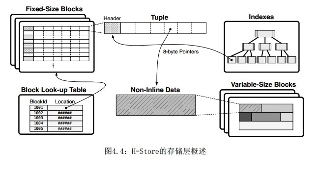
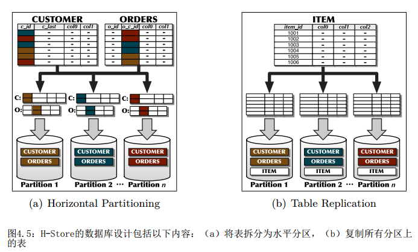
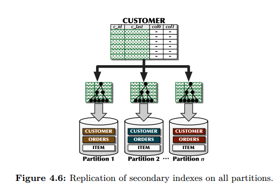
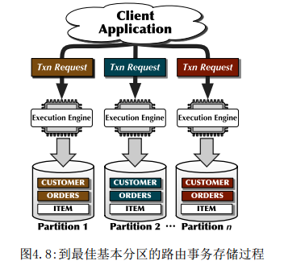

## 4.系统  
&emsp; 在本节中，我们将深入研究四个现代内存数据库系统。每个系统的设计和方法都不同，以解决第3章中讨论的问题。我们从4.1节开始，描述了Microsoft SQL Server的主内存OLTP擎Hekaton。然后，我们将在4.2节介绍H-Store及其商业分支VoltDB。第4.3节介绍了TU-Munich的HyPer系统，第4.4节介绍了SAP HANA。最后，我们通过总结第4.5节中其他现代商业和学术主存储系统的设计来总结本章。  
### 4.1 SQL Server Hekaton  
#### 4.1.1引言  
&emsp; Hekaton 是针对集成到 sql server 中的内存驻留数据进行优化的数据库引擎。该系统的官方名称是“In-Memory OLTP”，但通常称为Hekaton。探索和原型设计始于2009年，最初的版本发布在SQL Server 2014中。功能在SQL Server 2016中得到了显着扩展，例如，通过在Hekaton表上添加列存储索引，改进了对实时分析的支持。  
&emsp; 更准确地说, Hekaton 表是由 Hekaton 管理的表, 它完全存储在内存中, 并且可以有多个哈希索引和/或范围索引加上最多一个列存储索引。表是持久的和事务性的，但也支持非持久表。使用T-SQL和基于磁盘的表相同的方式访问它们。查询可以引用Hekaton表和基于磁盘的表，并且事务可以更新两种类型的表。只引用Hekaton表的T-SQL存储过程可以编译为本机机器代码，以进一步提高性能。Hekaton主要针对OLTP应用程序，旨在实现高水平的并发性。数据未分区 - 任何线程都可以访问表中的任何行。该引擎使用无锁存数据结构来避免线程之间的物理干扰，并采用新的乐观多版本并发控制技术来减少事务之间的干扰。数据库可以包含内存表和基于磁盘的表; 只有性能最关键的表需要在内存中。这允许逐步采用新技术，一次一个表和一个存储过程。  
##### 架构原则  
&emsp; Hekaton的设计遵循三个架构原则，旨在实现事务工作负载的低延迟和高吞吐量。
+ 优化内存的数据结构。Hekaton表和索引完全存在于内存中。 行是不可变的 - 每次更新都会创建一个新版本。这使得可以使用数据结构，特别是针对内存优化的索引。例如，对索引中的行的引用可以是直接物理指针。不需要缓冲池，因此完全避免了相关的开销和复杂性。  
+ 非阻塞执行。在多核系统上实现良好的扩展对于高吞吐量至关重要。当系统具有高速更新的共享数据结构（例如锁存器和自旋锁）或高度竞争的资源（例如锁管理器）时，可伸缩性会受到影响。所有Hekaton的内部数据结构，例如内存分配器，索引和事务映射，都完全无锁存（无锁）。系统中任何与性能相关的关键路径上都没有锁存器或自旋锁。Hekaton使用乐观的多版本并发控制，因此没有锁和没有锁表。结果是在一个系统中，线程执行事务而不会停止或等待。  
+ 编译对本机代码的请求。为了最大化运行时性能，仅访问Hekaton表的存储过程可以编译为专用的，高效的机器代码。  

#### 4.1.2数据组织
&emsp; Hekaton表可以有三种类型的索引：使用无锁散列表实现的哈希索引，使用Bw-trees [89]实现的范围索引，以及一个列存储索引。通过索引查找，索引范围扫描，列存储扫描或堆扫描（存储表的存储区的物理扫描）访问行。Hekaton使用多版本化; 更新始终会创建新版本。  
&emsp; 图4.1显示了一个包含六个行版本的简单银行帐户表。暂时忽略数字（100）和红色文本。该表有三个（用户定义的）列：名称，城市和金额。 版本包括标题和许多链接（指针）字段。版本的有效时间由存储在标头的Begin和End字段中的时间戳定义。  
&emsp; 示例表有两个索引，Name上的哈希索引和City上的范围索引。每个索引都需要行中的链接字段。第一个链接字段保留用于Name索引，第二个链接字段用于City索引。为了便于说明，我们假设哈希函数只选择名称的第一个字母。散列到同一存储桶的版本使用第一个链接字段链接在一起。Bw-tree的叶节点存储键和指向记录的指针。如果多个行具有相同的键值，则使用第二个链接字段将重复项链接在一起，并且Bw-tree指向链上的第一行。  
&emsp; 哈希桶J包含四个记录：John的三个版本和Jane的一个版本。Jane的单个版本（Jane，Paris，150）具有从15到无穷大的有效时间，这意味着它是由在时间15提交并且仍然有效的事务创建的。John最古老的版本（John，伦敦，100）在更新时从10时到20时有效。该更新创建了一个新版本（John，London，110）。 我们将在稍后讨论John的最后一个版本（John，伦敦，130）。

&emsp;&emsp;&emsp;&emsp;&emsp;

##### 读取  
&emsp; 每个读取操作都指定一个逻辑（as-of）读取时间，并且只有有效时间与读取时间重叠的版本才对读取可见;所有其他版本都被忽略。 行的不同版本具有非重叠有效时间，因此读取时最多只能看到一行的一个版本。例如，查找具有读取时间15的John将触发桶J的扫描，其检查桶中的每个版本但仅返回名称等于John且有效时间10到20的那个。
##### 更新   
&emsp; Bucket L包含两个属于Larry的记录。事务75正在将20美元从拉里的账户转移到约翰的账户。它为Larry（Larry，Rome，150）和John（John，London，130）创建了新版本，并将它们插入到两个索引中。  
&emsp; 注意，事务75已将其事务Id分别存储在新旧版本的Begin和End字段中。字段中的一位表示字段的内容类型。存储在“结束”字段中的事务Id可防止其他事务更新相同版本，并且还可识别正在更新版本的事务。存储在Begin字段中的事务Id通知读者该版本可能尚未提交，并标识创建该版本的事务。  
&emsp; 现在假设事务75提交结束时间戳为100。提交后，事务75返回旧版本和新版本，并将Begin和End字段分别设置为100。最终值在旧版本和新版本下方以红色显示。旧版本（John，London，110）现在的有效时间为20到100，新版本（John，London，130）的有效时间从100到无穷大。Larry的记录以同样的方式更新。  
&emsp; 多版本控制提高了可扩展性，因为读者不再阻止写着。尽管如此，写者仍可能与写者发生冲突。只读事务对更新活动几乎没有影响;他们只是根据需要阅读旧版本的行。多版本化还通过减少行的复制来加速查询处理。由于版本永远不会被修改，因此传递指向它的指针是安全的，而不是制作副本。  
&emsp; 系统必须丢弃不再需要的过时版本以避免填满内存。当某个版本对任何活动事务不再可见时，可以将其丢弃。清除过时的版本，a.k.a。垃圾收集，由所有工作者线程协同处理[38]。  
#### 4.1.3索引  
&emsp; 如前所述，Hekaton引擎中的所有数据结构（包括索引）都是完全无锁存的。Hekaton目前使用静态大小的哈希表，溢出桶实现为latchfree列表。它的范围索引是无锁存的B+-tree（Bw-tree）[89]。Bw-trees中自由锁存的关键是使用映射表将逻辑B +树页面标识符（PID）映射到内存物理页面。映射表是管理 "分页" 树的中心位置。Bw-tree页面之间的所有链接都是PID，而不是物理指针。映射表使Bw-tree节点页面的物理位置能够在每次更新时更改，而不需要将位置更改传播到树的根，因为页间链接是不更改的PID。  
&emsp;&emsp;&emsp;&emsp;&emsp;  
&emsp; Bw-tree通过写时复制执行页面更新，而不是通过就地更新（更新现有页面内存）。避免就地更新可以减少CPU缓存失效，这在多插槽机器上尤为重要。减少高速缓存未命中也会增加每个周期执行的指令。增量记录描述了页面P上单个记录的变化（例如，插入，更新，删除）。该增量物理上指向P。更新使用比较和交换（CAS）指令将增量记录的（新）存储器地址安装到映射表中的P的插槽中。如果CAS成功，增量记录的虚拟内存地址将成为页面的新物理“根”地址，从而成功更新页面。增量更新同时实现Bw-tree中的无锁存访问，并通过避免就地更新来保留处理器数据缓存。图4.2（a）描绘了页面P前面的增量更新记录D.虚线表示P的原始地址，而D的实线表示P的新地址。我们偶尔通过创建一个新页面来整合页面，该页面将所有增量更改应用于搜索优化的基页。这减少了内存占用并提高了搜索性能。该页面的合并形式也随CAS一起安装，如图4.2（b）所示，显示页面P及其增量合并为新的“合并页面P”。B+-tree结构修改（页面拆分和删除）也以无锁存方式执行。   
&emsp;&emsp;&emsp;&emsp;&emsp;
#### 4.1.4并发控制  
&emsp; Hekaton使用乐观并发控制来提供事务隔离; 没有锁，也没有锁表[77]。悲观并发控制通过锁定来防止冲突。乐观并发控制不会尝试防止冲突，而是通过在提交之前验证更新事务的读取来检测何时发生冲突。如果验证失败，则事务中止。  
&emsp; 事务可以处于以下四种状态之一：活动，准备，提交或中止。图4.3显示了状态之间可能的转换。 事务在其生命周期中经历三个不同的阶段。
1. 事务被创建; 它获取一个开始时间戳并将其状态设置为“活动”。  
2. 正常处理阶段。该事务在此阶段执行所有正常处理。事务永远不会在此阶段阻塞。对于更新操作，事务将其事务ID复制到新版本的Begin字段以及旧版本或已删除版本的结束字段中。如果中止，则将其状态更改为“已中止”并直接跳至步骤4。当事务完成其正常处理并请求提交时，它将获取结束时间戳并切换到“准备”状态。
3. 准备阶段。在此阶段，事务执行验证以确定它是否可以提交或被强制中止。如果必须中止，则将其状态切换为Aborted并继续下一阶段。如果它已准备好提交，它会将所有新版本和有关已删除版本的信息写入重做日志记录，并等待日志记录到达稳定存储。然后事务将其状态切换为Committed。  
4. 后处理阶段。如果事务已提交，则继续从新版本的Begin字段和旧版本或已删除版本的End字段替换其事务ID及其结束时间戳。如果事务已中止，则会将其所有新版本标记为垃圾。   
5. 事务现已终止。当事务的旧版本不再对任何活动事务可见时，他们分配给垃圾收集器，垃圾收集器负责物理删除它们。  

&emsp; 时间戳来自全局的，单调递增的计数器。事务通过原子读取和递增计数器获得唯一的结束时间戳。  
&emsp; 准备阶段的验证程度取决于事务的隔离级别。无论隔离级别如何，只读事务和在快照隔离下运行的更新事务都不需要验证。 当事务尝试更新版本并导致事务回滚时，会立即检测到写-写冲突。  
&emsp; 在可重复读取或可序列化隔离下运行的事务在提交之前需要验证。在验证期间，事务T检查以下两个属性是否成立。
+ 读稳定性。如果T在处理过程中读取了某个版本V1，我们必须确保V1在事务结束时仍然是T可见的版本。这是通过验证在T提交之前V1尚未更新来实现的。任何更新都会修改V1的结束时间戳，因此所需要的只是检查V1的结束时间戳。为了实现这一点，T保留了指向它已读取的每个版本的指针。   
+ 避免幻影。对于可序列化的事务，我们还必须确保事务的扫描不会返回其他版本。这是通过重新扫描以在提交之前检查新版本来实现的。为了实现这一点，可序列化事务保留其所有索引扫描的跟踪并保留足够的信息以便能够重复每次扫描.

#### 4.1.5查询处理
&emsp; 使用普通T-SQL通过本机编译的存储过程或通过查询互操作来访问内存表。为了获得最大速度, 仅访问内存中表的存储过程将被编译为自定义的高效机器代码。首先将T-SQL过程转换为C代码，该代码由Microsoft C编译器生成，然后生成DLL，然后将其加载到SQL Server进程中。生成的代码完全包含执行请求所需的内容，仅此而已。尽可能多的决策是在编译时进行的，以减少运行时开销。例如，所有数据类型在编译时都是已知的，允许生成有效的代码。  
&emsp; 经典的SQL Server引擎可以通过为此目的构建的特殊运算符访问或更新内存表。例如，存在索引扫描运算符，用于对Hekaton表上的索引执行查找或范围扫描。调用者指定搜索键或键范围，并且操作员输出具有经典引擎使用的内部行格式的请求列的限定行。这种互操作能力至关重要;例如，它用于临时查询，用于组合来自基于磁盘的表和内存表中的数据的查询，以及需要在本机编译的存储过程中不可用的功能的查询。  
#### 4.1.6持久性和恢复  
&emsp; 通过将日志和检查点行到外部存储来确保事务持久性。仅记录用户数据，而不记录索引。在恢复期间，Hekaton表及其索引完全从最新的检查点和日志尾部重建。  
&emsp; 成功通过验证的事务已准备好提交。此时，它会将日志创建的所有新版本以及已删除的所有版本的密钥写入日志。这是在一次写入中完成的（非常大的事务除外），如果写入成功，则事务不可撤销提交。不会记录中止的事务, 因此中止事务的成本很低。
##### 检查点  
&emsp; 为了缩短恢复时间，Hekaton还实现了检查点。检查点方案旨在满足三个关键要求。

+ 连续检查点。与检查点相关的I/O应根据需要以增量方式和持续方式进行, 以避免突然出现对事务性工作负载产生负面影响的I/O峰值。   
+ 顺序I / O.对于大多数操作，检查点应该依赖于顺序I/O而不是随机I/O.即使在SSD设备上，随机I / O也比顺序慢，并且可能导致更多的CPU开销。
+ 并行恢复。在恢复期间将数据加载到内存中应高度并行化，以充分利用可用的I / O带宽并最大限度地缩短恢复时间。

&emsp; 检查点数据存储在两种类型的检查点文件中：数据文件和增量文件。一个完整的检查点由多对数据和增量文件组成。数据文件包含在特定时间戳范围内创建的所有新版本。数据文件仅在打开时附加，一旦严格只读即可关闭。在恢复时, 数据文件中的版本将重新加载到内存中并重新编制索引, 但须通过增量文件进行过滤。  
&emsp; 增量文件存储有关从而实现经常引用的“实时分析”。随后删除其关联数据文件中包含的版本的信息。增量文件也是仅附加的。在恢复时，增量文件用作过滤器，以避免将已删除的版本重新加载到内存中。将一个增量文件与每个数据文件配对的选择意味着恢复的最小工作单元是数据/增量文件对，从而导致高度可并行化的恢复过程。  
&emsp; 完整的检查点与事务日志的尾部相结合，可以恢复Hekaton表。检查点具有时间戳，该时间戳指示检查点时间戳之前的所有事务的影响都包括在检查点中，因此无需从事务日志中恢复。  
&emsp; 检查点任务获取前一个检查点未覆盖的事务日志的一部分，并将日志内容转换为一个或多个数据文件并更新为增量文件。新版本将附加到最新数据文件或新数据文件中，已删除版本的ID将附加到与存储原始插入版本的数据文件对应的增量文件中。  
&emsp; 检查点中涉及的文件集随每个检查点而增长，但数据文件的活动内容会随着越来越多的版本在其增量文件中被标记为已删除而降级。由于崩溃恢复会读取检查点中所有数据和增量文件的内容，因此恢复性能会随着每个数据文件的实用程序的下降而降低。当相邻的数据文件的活动内容 (数据文件中未删除版本的百分比) 低于阈值时, 暂时合并相邻的数据文件时可避免此问题。合并两个数据文件DF1和DF2导致新的数据文件DF3覆盖DF1和DF2的组合范围。合并期间将删除所有已删除的版本，因此新的增量文件在合并后立即为空。

#### 4.1.7 性能和进一步说明
##### 性能问题
&emsp; 与传统的基于磁盘的数据库系统相比，主内存数据库可提供更高的吞吐量和更低的延迟.如果性能改进足够大, 这将产生真正的影响。下面的示例说明了一种这种情况。
&emsp; EdgeNet为供应商，零售商和搜索引擎提供优化的产品数据。为了在繁重的工作负载下优化性能，应用程序将从缓存中返回产品信息，而不是查询生产数据库。因为该公司从多个来源收到大量数据，如果不与读取进程和锁定事务冲突, 则无法直接写入生产数据库。相反，他们将文件接收到临时环境中，在加载到数据库之前对数据进行转换和结构化。可能需要一天时间来准备和加载信息，以便Edgenet寻找替代方案。他们想要一种在线交易处理（OLTP）解决方案，为客户提供实时的信息访问。
&emsp; 通过切换到Hekaton，EdgeNet可以允许读取和写入活动在同一数据库上并发运行，从而实现连续的数据接收。他们不再需要等待一天甚至一小时来筹划和准备数据。此外，它们还可以消除前端缓存层和用于数据加载的暂存区域。总之，从切换到主内存数据库获得的实质性性能够实现更好的客户服务和简化的系统配置。   
##### 进一步说明
&emsp; 参考文献[38]提供了最全面的Hekaton设计概述，包括数据存储和索引，并发控制，查询处理和编译，以及日志记录，检查点和恢复。[89]中提供了用于范围索引的Bw-tree的详细描述。[77] 中详细介绍了并发控制算法。[47] 中还介绍了编译过程。

### 4.2 H-Store与VoltDB
#### 4.2.1 引言
H-Store(商业版叫VoltDB)是一个旨在有效执行现代OLTP工作负载环境下的数据库管理系统。除了使用内存作为数据库的主要的存储介质之外，它的体系结构基于以下四个设计原则：
- **分区和串行执行**：除了允许事务的并发执行外，H-Store还会对数据进行分区并在每个分区上串行的执行事务。[[81](),[90](),[135](),[157]()]。这意味着它不需要使用重量级并发控制方案来管理细粒度锁。当一个事务执行时，它从不需要暂停，因为它所需要的所有数据都已经在内存中，并且它不会等待获取另一个事务持有的锁。
- **存储过程执行**：应用程序不是在运行时发送SQL命令，而是在H-Store中注册一组基于SQL的进程，并且只通过这些进程调用事务。将所有事务逻辑封装在存储过程中可以防止应用程序在事务中间停顿，并且还可以避免运行时执行查询计划的开销。虽然这种模式要求事先知道所有事务，但这种假设对于OLTP应用程序[[142](),[96]()]是合理的。
- **分布式部署**：为了支持大于单个节点上可用内存量的数据库，H-Store将跨无共享[[142]()]计算节点将数据库拆分为称为分区[[36](),[26]()]的不相交段。分区可以跨多个节点复制，着为事务处理系统提供了高可用性和容错性。
- **精简日志**：为了避免恢复机制的需要非常大的开销[[102]()]，H-Store使用了一个轻量级的逻辑日志记录方案，只需要记录运行的事务，而不需要记录事务对数据库所做的内存上的数据更改。

多年来，H-Store系统已经有了多个版本。最初的概念版是2007年在麻省理工学院开发的单节点引擎，它只能执行TPC-C基准测试的简化版本[[142]()]。H-Store的全功能通用版本由Brown，MIT，Yale和Vertica Systems于2008年开发。2009年，这个版本的H-Store建立了一个商业化的分支VoltDB。2010年，在VoltDB的一些更新也被同步的H-Store的源代码中，但是运行时事务管理子系统和协调子系统的部分被重写。 从那时起，H-Store在学术界上继续作为研究试验的平台，而VoltDB继续开发对实际部署具有重要意义的功能。

H-Store的架构分为两部分:(1) 前端事务管理组件和(2) 后端查询执行程序和存储管理器。 前端由用于与应用程序的客户机、事务协调器和存储过程通信的所有网络库组成。系统的这一部分是用Java编写的。每个分区的后端c++执行引擎包含存储管理器、索引和查询计划执行器。

#### 4.2.2 数据组织
图4.4中的图表显示了H-Store中表和索引的存储布局。在一个节点上的所有执行进程都在相同的地址空间中运行，但是它们的底层分区不共享任何数据结构。每个分区为数据库表维护单独的索引，这些表只包含与该特定分区关联的元组的条目。这意味着执行引擎无法访问存储在同一节点的另一个分区中的数据。表的内存存储区被拆分为固定大小的块和可变长度的块池。固定大小的块池是表元组的主存储空间。所有元组的大小都是固定的，以确保它们字节对齐。表中大于8字节的任何字段都单独存储在可变长度的内存块中。该块的8字节内存位置存储在该字段在元组中的位置[[135]()]。小于8字节的所有其他字段都是在线存储的。每个元组前面都有一个1字节的字段，其中包含有关当前事务是否修改或删除过元组的数据。此字段用于H-Store的快照机制（第4.2.6节）。

DBMS将块ID号的查找表维护到相应的内存位置。这个查找表允许执行引擎使用表存储区域中的4字节偏移量而不是8字节指针引用单个元组。也就是说，从4字节的偏移量开始，存储层可以用元组计算块的ID以及该块中元组的位置。

DBMS将未排序的表元组存储在存储块中。对于每个表，DBMS维护未占用（即空闲）元组的4字节偏移量列表。当事务删除元组时，删除的元组的偏移量将添加到此池中。当事务向表中插入元组时，DBMS首先检查表的池，以查看是否有可用的元组。如果池是空的，那么DBMS将分配一个新的固定大小块来存储要插入的元组。此插入操作不需要的附加元组偏移量因为插入操作作用在表的可用元组池中。如果从表中删除了大量元组，则H-store不会压缩块。

在H-Store上部署新应用程序之前，管理员必须向DBMS的项目编译器提供（1）数据库的模式，（2）应用程序的存储过程，以及（3）数据库的设计规范。编译器将生成一个目录，其中包含应用程序数据库中组件的元数据（如表、索引、约束）以及每个应用程序存储过程的已编译查询计划。

##### 数据库设计
应用程序的数据库设计规范定义了数据库的物理配置，例如是将一个特定的表划分为多个分区，还是在每个节点上复制它。这将确定每个事务在运行时访问的分区。设计模式确定H-Store是将来自应用程序的事务请求作为一个快速的单分区事务执行，还是作为一个缓慢的分布式事务执行。也就是说，如果表在节点之间划分，事务基础分区拥有事务所需的所有数据，那么它就是单分区的。确定任意应用程序的最佳配置并非易事，特别是对于具有许多依赖项的复杂企业应用程序。有大量关于最小化分布式事务和倾斜量的自动数据库设计的研究。[33,120]
- **表分区**：一个表可以水平地分为多个不相交的片段，它们的边界基于表的一个(或多个)列的值（例如分区属性）[160]。DBMS使用范围分区或散列分区，根据这些属性的值将每个元组分配到特定的片段。来自多个表的相关片段被组合到一个分区中[51,118]。OLTP应用程序中的大多数表将以这种方式分区。在图4.5(a)的示例数据库中，CUSTOMER表中的每个记录都有一个或多个ORDERS记录。因此，如果两个表都在根据WAREHOUSEid分区（例如CUSTOMER.W_ID 和ORDERS.W_ID），然后，无论数据库的状态如何，只访问单个仓库中的数据的所有事务都将作为单分区执行。
- 

- **表复制**: 除了把表分成多个分区之外，数据库还可以跨分区复制表。表复制对于只读或读(主要是与其他表一起访问但不共享外键祖先的表)非常有用。这与为了持久性和可用性复制整个分区是不同的。例如，图4.5(b)中的只读项表与CUSTOMER表没有外键关系。通过复制这个表，事务不需要从远程分区检索数据来访问它。但是修改复制表的任何事务都必须作为分布式事务执行，该分布式事务锁定集群中的所有分区，因为这些更改必须广播到集群中的每个分区。除了避免额外的分布式事务之外，还必须考虑在每个分区复制表所需的空间。

#### 4.2.2 索引
对于惟一索引和非惟一索引，H-Store支持哈希表和b树数据结构。索引中的条目值是元组的偏移量。由于分区内的执行是单线程的，因此索引实现不需要是线程安全的。这将导致更简单的索引实现和更短的代码路径。

##### 二级索引的复制
当查询使用不属于该表分区属性的列访问表时，它将广播到所有分区。这是因为DBMS不知道哪个分区具有查询所需的元组。然而，在某些情况下，如果数据库包含跨所有分区复制的表列子集的辅助索引，则这些查询可能成为单分区查询。考虑图4.6所示数据库的一个事务，该事务执行一个查询，使用CUSTOMER的last name检索CUSTERM的id。如果每个分区包含一个具有id和last name列的辅助索引，那么DBMS可以自动重写存储过程查询计划，以利用这个数据结构，从而使更多的事务单分区。只有在这些索引中选择的列不经常更新的情况下，这种技术才能提高性能。

#### 4.2.4 并发控制
与在分区[17]上同时执行多个事务的重量级并发控制方案不同，H-Store在每个分区上一次执行一个事务。也就是说，当事务在H-Store中执行时，它对所需分区上的数据和索引具有独占访问权。事务不会因为等待获取另一个事务持有的锁而停止，因为在它的基本分区或远程分区上不会同时运行任何其他事务。

H-Store基于时间戳调度事务[17]。当事务请求到达节点时，协调器根据其到达时间戳为请求分配唯一标识符id。这个id是一个组合键,由三部分组成，其一为当前节点的墙上时钟时间(以毫秒为单位),其二为次的墙上时钟时间已经到达的事务数量的计数器(如果多个事务在同一时间进入系统),和事务的基础分区id [149]。

每个分区都由一个由其协调器管理的锁保护，该锁根据事务ID的顺序一次授予事务[5、17、32、157]。如果（1）事务的最低ID不大于授予该锁的最后一个事务的最小ID，并且（2）自事务首次进入系统以来已至少5 ms，则事务获取分区S锁[142]。这个等待时间确保了通过网络向远程分区发送锁获取消息的分布式事务不会受到限制。我们假设使用标准的时钟偏移算法来保持每个节点上不同的CPU时钟同步。

以这种方式在每个分区序列化事务对于OLTP工作负载有几个好处。在这些应用程序中，大多数事务一次只访问数据库中的单个实体（例如，在单个客户上操作的事务）。这意味着，如果数据库的分区方式使大多数事务只访问一个分区，那么DBMS的执行速度比传统的DBMS快得多。Smallbase是这种方法的早期支持者[65]，最近的例子包括k[157]和granola[32]。然而，这种方法的缺点是，它意味着需要在两个或多个分区上访问数据的事务明显较慢。如果一个事务试图访问它不持有锁的分区上的数据，那么DBMS会中止该事务（释放它持有的所有锁），恢复任何所作的更改，然后在事务重新获取它需要的所有锁后重新启动它。采用这种方法可以消除分布式死锁检测的需要，从而为OLTP应用程序中的短期事务提供更好的吞吐量[60]。

协调器在包含事务将要访问的分区的所有节点处对请求进行排队。当事务获取分区的锁时，协调器准备一条确认消息，以将其发送回事务的基本分区。一旦事务从节点的分区获取了它需要的所有锁，协调器就会发送这个确认。一旦一个事务接收到它所需要的分区的所有锁确认，它的基本分区的协调器就会安排事务立即在它的基本分区的执行引擎上运行[18，24]。

#### 4.5.4 查询处理
H-store中的每个分区都由单线程的执行引擎管理，该引擎对该分区上的数据具有独占访问权。执行引擎由两部分组成，一部分是用Java编写的，另一部分是用C++编写的。在Java级组件中，执行引擎的线程在队列中阻塞，等待代表事务执行工作的消息。此工作可以指示引擎调用过程的控制代码以启动新事务，或者代表在另一个分区上运行的事务执行查询计划片段。注意，对于后者，H-Store的事务协调框架确保不允许事务在执行引擎上排队查询请求，除非事务持有该引擎分区的锁。

在执行引擎的c++ 库中，H-Store存储数据库并处理查询。Java层使用Java Native Interface (JNI)框架调用c++ 库中的方法，并将事务调用的查询计划标识符传递给它。此库不知道集群中的其他分区或节点;它只对所提供的输入进行操作。

##### 存储过程
每个存储过程由唯一的名称标识，并由调用预定义参数化SQL命令的用户编写的Java控制代码(例如应用程序逻辑)组成。应用程序通过向DBMS发送一个包含过程名称和集群输入参数的请求来启动事务。这些存储过程的输入参数可以是标量值或数组基元值。

如图4.7中的示例所示，存储过程具有包含该过程的应用程序逻辑的run方法。在H-Store中没有显式的事务开始或提交命令。当其基本分区的执行引擎调用此方法时，事务开始，然后在此方法返回时完成(通过返回或中止命令)。当此控制代码执行时，它在运行时发出查询调用请求，方法是将目标查询句柄和该调用的输入参数传递给H-Store运行时的API（例如queueSQL）。这些输入参数的值将被替换为查询的参数占位符（在图4.7中的SQL语句中表示为？）。DBMS将每次调用进行排队，然后立即返回到控制代码。即使使用相同的输入参数，对同一查询的多个调用也被视为独立的。将所有需要的调用请求添加到当前批处理后，控制代码指示DBMS分派批处理以进行执行操作（例如executeBatch）。此时，控制代码被阻塞，直到DBMS完成当前批处理中的所有查询或由于错误而中止事务为止（例如如果其中一个查询违反完整性约束）。此命令返回上次执行的批处理中每个查询调用的输出结果的有序列表。

H-Store包括内置于DBMS中的特殊系统存储过程。这些过程允许用户执行系统中的管理功能，例如将数据批量加载到表中、修改配置参数和关闭集群。

虽然H-Store中的存储过程包含任意用户编写的Java代码，但我们要求它们的所有操作和副作用都是确定性的。 也就是说，必须编写每个存储过程，使得如果DBMS使用相同的输入参数并且以相同的顺序（相对于其他事务）再次执行事务，则该事务完成之后的数据库的状态将是相同的。 这意味着不允许过程的控制代码在再次执行时产生不同结果的操作。 此要求是H-Store恢复所必需的（第4.2.6节）

存储过程控制代码中禁止的非确定性操作的类型包括（1）使用过程内的RPC库与外部系统通信，（2）从节点的系统时钟中检索当前时间，或（3）使用随机数发生器。作为这些问题的一个例子，考虑一个与外部第三方欺诈检测系统联系的程序，以确定在交易过程中财务转移是否是欺诈性的。然后，事务将根据此系统的响应选择是提交还是中止。在H-Store事务中执行此操作的一个问题是，如果通过在不同节点（即，复制的部署）上运行的相同事务的不同调用多次向其发送相同的请求，则该服务可以报告误报。另外，当DBMS重放事务（即，崩溃恢复）时，该服务可能在以后不可用。在任何一种情况下，数据库都将不一致。因此，为了使该应用程序在H-Store中可靠地工作，开发者将需要在该过程之外进行移动欺诈检测操作。

##### 存储过程的路由

除了分区或复制表之外，数据库设计还可以确保将每个事务请求路由到具有所需数据的分区（即其基本分区）[126]。 H-Store使用在运行时设计中定义的过程路由属性将新的事务请求重定向到将要执行它的节点[112]。每个过程的最佳路由属性使DBMS能够识别哪个节点具有每个事务所需的最多（如果不是全部）数据，因为这允许它们可能以减少的并发控制执行[120]。图4.8显示了如何根据与CUSTOMER表的分区属性对应的输入参数的值来路由事务。如果事务在一个节点上执行但其所需的数据在其他地方执行，那么它必须以完全并发控制执行。对于许多应用程序来说这很困难，因为它需要使用基于工作负载的近似或静态代码分析将过程输入参数映射到其查询输入参数。

#### 4.2.6 持久化与恢复
由于H-Store是内存数据库，因此必须确保所有事务的修改都是持久的，并且在节点崩溃时可以恢复。 然而，关键是提供这种保证而不会明显的阻碍系统的性能优势。 由于H-Store设计为在商用硬件上运行，我们不能假设DBMS将使用专用组件（例如，备用电池的内存）进行部署[49]。

鉴于此，H-Store使用轻量级逻辑日志记录方案，与现有的面向磁盘的系统相比，其开销更少[102]。 它还将采用数据库的定期检查点来减少崩溃后系统的恢复时间。 图4.9描述了该过程的概述。 我们现在讨论这两种机制。 然后，我们将在4.2.6节讨论H-Store如何从这些日志和检查点恢复数据库的状态。

##### 命令日志
如3.4节所述，日志有物理日志和逻辑日志等日志形式。 H-Store使用逻辑日志的变体，称为命令日志，其中DBMS仅将事务调用请求记录到日志[96]。 每个日志记录包含存储过程的名称和从应用程序发送的输入参数以及事务的标识。 因为一个日志记录代表整个事务调用，所以命令日志记录不支持事务保存检查点[103]。 这不是一个重要的限制，因为OLTP事务是短暂的。

H-Store使用单独的线程保存日志记录;执行引擎永远不会被日志记录操作阻止。 DBMS在事务执行之后将结果返回给应用程序之前写入条目。这与预写日志[59]不同，它的DBMS在执行之前会记录事务请求。这有两个好处。第一个是DBMS不需要为中止的事务写出条目，因为系统确保在执行下一个事务之前首先回滚中止事务所做的所有更改。因此，中止事务对数据库状态的影响与从未执行过时相同。其次，由于H-Store可以由于内部控制机制而重新启动事务，因此可以为事务分配多个事务标识符。例如，当事务尝试访问它没有锁定的分区时，DBMS将重新启动该事务，回滚它所做的任何更改，为其分配新的事务标识符，然后在它需要的分区重新提交锁定获取请求。如果DBMS在执行之前记录了事务的命令，则每次重新启动事务时都需要写入一个新条目，该条目将前一个条目标记为无效。

DBMS将命令日志条目组合在一起以进行多个事务，并将它们批量写入以分摊写入磁盘的成本[36,61,157]。 在刷新日志记录之前，应用程序不会看到事务所做的修改。同样，在将事务之前执行的所有事务写入命令日志之前，无法将事务释放到应用程序。

##### 快照
当DBMS执行事务并将其命令写入日志时，DBMS还会创建数据库表[90,142]的非阻塞快照。 每个分区的快照都写入其主机节点的本地磁盘。 当系统在崩溃后需要恢复数据库时，它会在最后创建的检查点中加载，然后只重放在此检查点之后出现在命令日志中的事务[96]。 这大大减少了恢复数据库所需的时间。 H-Store的快照仅包含表中的元组，而不包含索引。

可以将DBMS配置为使用系统存储过程定期或手动获取检查点。 系统还维护一个快照的目录，该目录可由应用程序通过另一个系统过程检索。

当H-Store启动新检查点时，DBMS中的一个节点被选为下一个检查点的协调节点。该节点可以随机选择（如果它是由DBMS发起的预定检查点），也可以是具有事务基本分区的节点（如果它是通过系统过程启动的）。此节点上的DBMS向集群中的每个分区发送特殊事务请求，以指示它们开始检查点进程。此请求锁定所有分区，以确保每个节点从事务一致的数据库状态开始编写检查点[122]。该系统过程使所有分区的每个执行引擎切换到特殊的“写时复制”模式。未来事务所做的任何更改都不会覆盖当前检查点启动时存在的元组，并且在检查点启动后插入的任何新元组都不会包含在快照数据中。一旦所有分区都发回确认，DBMS就会提交特定的事务，并且每个分区都会在单独的线程中开始将快照写入磁盘。然后，执行引擎返回处理事务，而快照处理在后台进行。

分区上的执行引擎将数据库快照完成到磁盘所花费的时间取决于数据库的大小和存储设备的写入速度。 在分区引擎完成快照写入后，它会禁用“写时复制”模式并将通知消息发送回协调节点。 一旦协调节点收到来自每个分区的通知，它就会向每个分区发送最终完成消息，指示它们清理瞬态数据结构并将快照标记为完成。
##### 故障恢复
从命令日志和快照还原数据库的过程很简单[96]。 首先，当H-Store节点启动时，节点上的每个执行引擎都会读取其分区上最后一个快照的内容。 对于快照中的每个元组，DBMS必须确定应该存储该元组的分区，因为它可能与在该快照中读取的分区不同。 如果管理员在系统脱机时更改群集中的分区数，则可能发生这种情况。 当引擎加载到每一行时，它还将在其分区上重建表索引。

一旦快照从磁盘上的文件加载到内存中，DBMS将重放命令日志以恢复数据库，以恢复它在崩溃之前所处的状态。 一个单独的线程向后扫描日志以查找与发起刚刚加载的快照的事务相对应的记录。然后在那个点上从此点向前扫描日志并重新提交每个条目作为新的事务请求。 事务协调器确保这些事务按照它们到达系统的确切顺序执行; 这与允许重新排序和重新执行事务的正常执行策略不同。

即使重放期间的分区数与运行时的分区数不同，也可确保此恢复过程之后的数据库状态正确。 这是因为（1）事务以串行顺序记录和重放，因此重新执行的顺序与初始执行完全相同，并且（2）重放从不包含任何未提交数据的事务一致性快照开始，因此在恢复时不需要回滚[59,122,96]。

### 4.3Hyper  
#### 4.3.1 引言 
&emsp; 内存数据库系统HyPer是在慕尼黑技术大学开发的，用于在相同的数据库状态下提供混合OLTP和OLAP工作负载，并提供完整的ACID保证。这允许在最新的事务性数据库状态上进行OLAP数据浏览(浏览);从而实现经常引用的“实时分析”。传统上，两个工作负载OLTP和OLAP在两个专用系统中分开：事务数据库有规范化的框架并且数据仓库用于以分析为主的查询处理。由于数据刷新之前的时间延迟，必要的ETL过程会引起数据仓库的复杂性和陈旧性问题。  
&emsp; 更强大的数据库服务器的出现，即使是具有许多核心和几TB主存储器容量的商用服务器，最终也为在单个系统实例中整合这两个异构工作负载铺平了道路。  
#### 4.3.2数据组织
##### 通过快照隔离OLTP事务和OLAP查询  
&emsp; 为了在同一数据库状态下同时容纳OLTP和OLAP工作负载，有必要将这两个任务有效地隔离开来。一种可能的更新暂存方法是它在包含较旧的，主要是不可变数据对象的主数据库系统和包含最近插入和更新的数据对象的增量存储之间分隔数据。增量存储会定期合并到主存储中。更新暂存方法的缺点是为了将增量与主数据库系统合并而产生额外的重组工作, 这导致我们设计了一种替代体系结构, 在这种体系结构中, 事务数据库完全保持在一致的状态。  
&emsp;&emsp;&emsp;&emsp;&emsp;    
&emsp; HyPer利用操作系统功能为新的重复进程创建虚拟内存快照。例如，在Unix中，这是通过fork（）系统调用创建OLTP进程的子进程来完成的。为了保证事务一致性，fork（）应该只在两个（串行）事务之间执行，而不是在一个事务的中间执行。通过使用撤消日志将操作一致性快照（在事务中间创建）转换为事务一致性快照，可以放宽此约束。   
&emsp; fork子进程获得父进程地址空间的精确副本，如图4.10左侧所示的覆盖页面框架面板所示。fork（）操作创建的虚拟内存快照将用于执行OLAP查询 - 如图4.10右侧所示。
&emsp; 快照保持精确处于fork（）发生时存在的状态。 幸运的是，最先进的操作系统不会立即物理复制内存段。相反，他们采用了一种懒惰的写时复制/更新策略 - 如图4.10右侧所示。最初，父进程（OLTP）和子进程（OLAP）通过将虚拟地址（例如，对象a）转换到相同的物理主存储器位置来共享相同的物理内存段。内存段的共享在图形中通过虚线框突出显示。虚线框表示尚未（尚未）复制的虚拟内存页面。只有当对象 (如数据项 a) 被更新时, os 和硬件支持的复制更新机制才会启动所驻留的虚拟内存页的复制。此后，存在表示可由OLTP进程访问的新状态，其执行事务并且旧状态表示为a，其可由OLAP查询会话访问。与图所示不同的是, 附加页面实际上是为启动页面更改的OLTP过程创建的, OLAP快照引用旧页面-如果创建了多个此类快照, 此详细信息对于估计空间消耗非常重要。此快照机制通过操作系统与内存管理单元（MMU）的组合，将OLTP事务处理与OLAP查询评估完全分开。
##### 混合存储结构  
&emsp; 如第3章所述，HyPer避免了特定于数据库的缓冲区管理和页面结构。数据驻留在虚拟存储器内的简单的内存优化数据结构中。因此，HyPer以“全速”利用OS / CPU实现的地址转换，而无需任何额外的间接手段。即使虚拟内存可以（显着）超过物理主内存，我们也会将数据库限制为物理主内存的大小，以避免操作系统控制的虚拟内存页面交换。  
&emsp; 对于在虚拟内存中组织关系, 在设计空间的边界上有两个众所周知的极端:在行存储方法中，关系被维护为整个记录的数组，并且在列存储方法中，关系被垂直划分为属性值的向量。HyPer可以配置为作为列或行存储 - 但表格布局也可以根据访问模式进行调整。在混合存储格式中，可以将频繁访问的那些属性聚类成构成非冗余垂直分段的单个向量。在混合存储格式中, 可以将经常访问在一起的属性聚集到一个矢量中, 构成非冗余的垂直碎片。  
&emsp; 假设经常发生以下查询：  
&emsp; select oDate, sum(oPrice)  
&emsp; from Orders   
&emsp; where oDate >= 20130101  
&emsp; group by oDate  
&emsp; 然后将两个属性oDate和oPrice聚类到同一个向量中将是有益的。下面我们展示了这样的存储布局（为简单起见，该示例使用C ++ / STL进行矢量集合，尽管HyPer使用了自己的数据结构）：  
///订单  
struct Order {&emsp;unsigned id;   
&emsp;&emsp;&emsp;&emsp;&emsp;&emsp;&emsp; unsigned customer;   
&emsp;&emsp;&emsp;&emsp;&emsp;&emsp;&emsp; unsigned oDate;  
&emsp;&emsp;&emsp;&emsp;&emsp;&emsp;&emsp; double oPrice;   
&emsp;&emsp;&emsp;&emsp;&emsp;&emsp; };  
struct OrderDatePrice {&emsp;unsigned oDate;   
&emsp;&emsp;&emsp;&emsp;&emsp;&emsp;&emsp;&emsp;&emsp;&emsp;&emsp;&emsp;double oPrice;  
&emsp;&emsp;&emsp;&emsp;&emsp;&emsp;&emsp;&emsp;&emsp;&emsp;&emsp;   
///混合格式的所有订单  
struct Orders {
vector<unsigned> data_id;  
&emsp;&emsp;&emsp;&emsp;&emsp;&emsp;&emsp;vector<unsigned> data_customer;  
&emsp;&emsp;&emsp;&emsp;&emsp;&emsp;&emsp;vector<unsigned> data_product;  
&emsp;&emsp;&emsp;&emsp;&emsp;&emsp;&emsp;vector<OrderDatePrice> data_oDate_oPrice;  
&emsp;&emsp;&emsp;&emsp;&emsp;&emsp;&emsp;void insert(Order&& order);  
&emsp;&emsp;&emsp;&emsp;&emsp;&emsp;&emsp;};   
&emsp; 查询的代码生成.然后可以将上面显示的示例查询转换为以下C ++代码，该代码依赖于对一个集群向量data_oDate_oPrice的扫描：   
unordered_map<unsigned, double> revenueByDate(Orders& orders)  
{  
&emsp;&emsp;&emsp;&emsp;unordered_map<unsigned, double> groupBy;  
&emsp;&emsp;&emsp;&emsp;for (OrderDatePrice date_price : orders.data_oDate_oPrice) {  
&emsp;&emsp;&emsp;&emsp;&emsp;&emsp;&emsp;&emsp;if (date_price.oDate >= 20130101) {  
&emsp;&emsp;&emsp;&emsp;&emsp;&emsp;&emsp;&emsp;&emsp;&emsp;&emsp;&emsp;groupBy[date_price.oDate] += date_price.oPrice;  
&emsp;&emsp;&emsp;&emsp;&emsp;&emsp;&emsp;&emsp;}  
&emsp;&emsp;&emsp;&emsp;}  
return groupBy;  
}  
&emsp; 该程序片段简化了HyPer查询引擎的许多方面;然而，它旨在证明翻译声明性SQL查询确实可以产生与手写代码一样快（或由于多核并行化甚至比手写代码快得多）的可执行代码。  
&emsp; 实际的HyPer引擎在某些主要方面偏离了这个简单的代码生成：   
1. HyPer采用成熟的高级查询优化器来优化连接顺序，取消嵌套子查询，谓词下推等。  
2. HyPer将用HyPerScript编写的SQL查询和事务程序编译为LLVM汇编程序代码。最重要的优点是消除了需要几秒钟的C ++编译器，从而阻碍了交互式查询处理。  
3. HyPer自动并行化查询执行，以充分利用多核服务器，如今，它拥有数十个或数百个核心。
4. HyPer采用复杂的数据结构和算法，这些数据结构和算法特别具有高速缓存意识，并且可以为线程级并行化带来低同步开销。  
&emsp;&emsp;&emsp;&emsp;  

&emsp; 动态存储分配。HyPer最初假设关系仍然很小并且仅分配固定（小）向量 - 以避免动态分配存储的簿记开销。但是，一旦关系增长超过某个阈值，动态增长的分区向量将通过直接映射表DM进行寻址，如图4.11所示，用于HyPer。一个水平片段的所有数据向量连续存储。如果使用纯列式格式，则连接所有属性向量。在我们的示例中，我们选择了一个聚类数据向量，该向量恰好存储在片段的末尾。每次片段溢出时，都会分配一个新片段，使（可能的）行的总数加倍。因此，图中的前两个片段有两行空间，下一行为四行，然后为八行，等等。访问特定位置的属性，比如检索行007的Product的属性值分两步完成：  
1. 通过直接映射表DM查找片段的起始地址。DM中的地址是通过相当有效的转换找到的, 方法是计算64位行号的前导零, 并从DM中的位置数中减去该地址。在示例中, 这将生成直接映射表中的标记位置。  
2. 检索到相应片段的起始地址（示例中的第三个片段）后，地址计算产生属性值的标记位置。根据片段中的行数和属性的宽度, 通过预先计算实例化表优化此地址计算。  

&emsp; 通过直接映射表的间接引起的开销很小，因为它足够小以适应L1高速缓存，并且预实现化支持所有地址转换。   
#### 4.3.3索引  
&emsp; HyPer使用新的内存索引，该索引依赖于搜索关键字的基数分段。因此，大多数可以使用无分支和无比较的代码来导入从根到叶的基数树索引。树的每个级别都维护搜索关键字的特定基数片段 - 在我们的例子中是一个字节。在HyPer之前，基数树（通常称为尝试）由于在每个节点中保持最大扇出度而遭受差的存储利用率。与平衡搜索树相比，像AVL-或红/黑树尝试具有“漂亮”属性，其高度不依赖于索引对象的数量。相反，搜索键的长度决定了基数树的高度。  
&emsp;HyPer基数树设计，称为自适应基数树ART [85]，根据节点的实际扇出使用自适应节点大小，以保证良好的空间利用率。因此, 一个节点开始时的空间很小, 为四向扇出, 然后增长到16路扇出的大小。如果插入了更多的搜索键，它会增长到48路扇出，并最终变为扇出256。  
&emsp; 如上所述，ART采用四种自适应大小的节点类型：
+ 节点4:此节点类型最多存储四个已排序的搜索键, 最多可以输入四个风扇。  
+ 节点16：此处，最多16个搜索键按排序顺序存储。  
+ 节点48：在此节点类型中，使用256个元素的数组，每个搜索键有一个条目。这些条目构成指向要找到“真实”子指针的48个位置之一的短（即一个字节）指针。
+ 节点256：这里使用256元素数组，其中条目包含指向子节点的指针。

&emsp; 图4.12提供了一个自适应节点类型的示例，它显示了一个从根到叶子的ART树的样本路径，该树索引了四字节整数。树的高度是4.出于说明目的，样本路径以这样的方式构造，即所有四种节点类型都出现在其中。搜索树中的路径是为整数搜索关键字218237439构造的，它由四个单字节部分13&2＆9＆255组成。根节点恰好是Node4类型。在前往叶子的路上，遇到其他三种节点类型。   
    
&emsp; 在设计节点类型时，重点是存储效率和搜索效率。例如, 节点类型 node16 的构造使具有矢量指令的现代处理器上的所有存储的搜索键 (即所有16个字节) 都可以并行比较。  
&emsp; 除节点适应性外，ART中还包含两个进一步的优化：由于不需要扇出, 导致单叶的长搜索键被折叠。因此, 这些叶子被拉到搜索树的内部。插入另一个具有相同前缀的键之后, 这些节点将在生成的树中沉入较低的位置。 此外，节点的所有搜索关键字共有的前缀被“分解”并仅存储一次。这对于索引键 (如所有前缀为 "http p///" 的 url) 特别有用。这些技术与自适应节点大小调整相结合，可确保每个键的最坏情况空间使用受52个字节的约束。   
####  4.3.4并发控制  
&emsp; 由于HyPer是混合OLTP / OLAP引擎，因此保持快速扫描性能至关重要。因此，在设计用于事务隔离的多版本并发控制方案时，必须安装最新的更新以保留连续的数据放置，以便处理器的预取器可以在扫描关系时主动将数据移动到缓存中。MVCC主要用于隔离并行OLTP事务。仍然可以为计算密集型分析查询分叉OLAP快照。  
&emsp; 图4.13说明了使用传统银行示例的版本维护。为简单起见，数据库由一个Accounts表组成，该表仅包含两个属性：Owner和Balance。HyPer不会创建新版本; 并在更新事务的撤消缓冲区中维护更新（但未提交）和替换版本之间的后向增量。就地更新数据保留了数据向量的连续性, 这对于高扫描性能至关重要。    
&emsp;&emsp;&emsp;&emsp;   
&emsp; 在提交事务时，新生成的版本增量必须重新生成以确定其有效间隔。在其撤消缓冲区中对事务的所有版本增量进行聚类可以极大地加速此提交处理。此外，使用撤消缓冲区进行版本维护，MVCC模型几乎不会产生存储开销，因为它需要在事务处理期间维持版本增量（即，更改的前映像），无论如何都要进行事务回滚。唯一的区别是撤销缓冲区（可能）维持稍长的持续时间，即，只要活动事务可能仍然需要访问撤消缓冲区中包含的版本。因此，图4.13中所示的VersionVector锚定了“最新到最旧”方向的版本重建增量链（即列值），可能跨越不同事务的撤消缓冲区。即使对于列存储后端，每个记录也只有一个VersionVector，因此版本链通常连接一个记录的不同列的前映像。  
&emsp; 只有一小部分数据库会被版本化，因为旧版本在不再需要时会不断地进行垃圾回收。如果所有活动事务都在增量标记后开始, 则版本 (重建增量) 将过时。每当相应的记录未版本化时，VersionVector都包含null，否则返回指向撤消缓冲区中最近替换版本的指针。    
&emsp; 在示例中，只有两种事务类型：转账交易标记为“来自(from!to)！ 通过首先从一个帐户的Bal中减去1然后将1添加到另一个帐户的Bal，将$ 1从一个帐户转移到另一个帐户。只读事务表示所有余额的总和, 在我们的 "封闭世界" 示例中, 应始终计算150美元, 无论它们在什么情况下运行时间戳。  
&emsp; 进入系统的所有新事务都与两个时间戳相关联：transactionID和startTime-stamps。提交后, 更新事务将收到第三个时间戳, 即确定其序列化顺序的提交时间戳。最初，所有事务都分配了高于任何事务的任何startTime-stamp的标识符。  
&emsp; 更新事务就地修改数据，在撤消缓冲区中保留旧版本的数据。这个旧版本有两个目的：（1）在事务被回滚（撤消）时需要它作为前映像，而（2）它作为到目前为止有效的已提交版本。当更新程序仍在运行时, 新创建的版本将使用其事务 id 进行标记, 因此未提交的版本只能由更新事务本身访问。在提交时，更新事务接收其commitTime-stamp，其中的版本增量（撤消日志）被标记为与从“现在”开始的事务无关。此commitTime-stamp取自生成startTime-stamps的同一序列计数器。    
&emsp; 在该示例中，在时间戳T3（Sally！Wendy）处提交的第一个更新事务在其撤消缓冲区中创建的版本增量分别为Sally和Wendy的余额加上时间戳T3。时间戳指示必须对startTime低于T3的事务应用这些版本增量，并且对于从T3开始的事务，后续版本对此有效。在startTime T4，具有transactionID Tx的读取器事务进入系统并仍处于活动状态。它将读到的Sally的余额为重建值9，Henry的重建值为10，Wendy的重建值为11.另一个更新事务（Sally！Henry）在时间戳T5提交。同样，属于Sally和Wendy的余额的版本在T5更新之前有效，在T5的撤消缓冲区中保留为之前的映像。请注意，重建版本从其前任的时间戳到其自己的时间戳有效。因此，使用T5的撤消缓冲区重建的Sally的Balance版本从时间戳T3到时间戳T5有效。如果版本增量没有前导（由空指针指示），例如在T5的撤销缓冲区中的Henry余额版本，则其有效性被确定为从虚拟时间戳“0”直到时间戳T5。具有低于T5的startTime的事务的任何读取访问都应用此版本增量，并且任何具有高于或等于T5的startTime的读取访问将忽略它，从而读取Accounts表中的就地版本。    
&emsp; 尚未提交的版本的增量接收临时时间戳，该时间戳超过已提交事务的任何“实际”时间戳。    
&emsp; 这是为更新事务（Sally！Henry）举例说明的，该事务被分配了更新程序的transactionID时间戳Ty。这个临时的，非常大的时间戳最初被分配给Ty的撤消缓冲区中的Sally的Balance版本增量。任何读取访问，除了事务Ty的那些，具有高于T5的开始时间戳（并且显然低于Ty）将应用此版本增量以获得值8。只有Ty可以看到Sally平衡值为7的未提交的就地版本。   
##### 可序列化验证  
&emsp; HyPer的MVCC方法故意避免写写冲突，因为它们可能导致级联回滚。如果另一个事务尝试更新未提交的数据对象，则会中止并重新启动它。因此，第一个VersionVector指针始终指向包含已提交版本的撤消缓冲区 - 对于指针为空的无版本记录。如果同一事务多次修改同一数据对象，在同一个撤消缓冲区内有一个内部指针链，最终会导致提交的版本。   
&emsp; 为了保留可扩展的无锁系统，HyPer依赖于其MVCC模型中的乐观执行。在没有任何进一步验证的情况下，所描述的CC方案保证（仅/已）快照隔离。为了保证完全可串行化，在事务结束时需要验证阶段，以确保在事务处理期间的所有读取都可以在事务的最后读取（逻辑上），而不会发生任何可观察到的更改。验证检测到四个相关的转换: 与事务 "真正" 相关的对象T的修改、删除、创建、创建和删除,为此，事务从计数器中绘制一个commitTime-stamp，它也生成startTime-stamps。新绘制的数字决定事务的序列化顺序。只有在T的生命周期内，即在startTime和commitTime之间提交的修改才相关，如果这些修改/删除/创建的对象确实与T的读取谓词空间相交。   
&emsp; 与之前可能需要重新检查大型读取集（和扫描集）的验证方案相反，HyPer将验证限制为最近更改和提交的数据对象的数量，无论事务的读取集有多大。为此，HyPer使用一种称为精确锁定[69]的旧（并且在很大程度上被“遗忘”）技术，它消除了谓词锁定的固有可满足性测试问题。这种精确锁定测试的这种变化针对正在验证的事务的面向谓词的读取对最近提交的事务进行离散写入 (更新、删除和记录插入)。因此，如果这种扩展写入与验证中的事务的内涵读取相交，则验证失败[155]。验证如图4.14所示，其中事务T在三个不同的谓词P1，P2和P3下读取对象，形成T的谓词空间。我们需要在右侧验证三个撤消缓冲区，并验证它们的对象（即数据点）不与T的谓词相交。这是通过评估这些对象的谓词来完成的。 如果谓词不匹配，则没有交集并且验证通过，否则存在冲突。   
&emsp;&emsp;&emsp;&emsp;   
&emsp; 为了找到在事务T的生存期内提交的其他事务的扩展写入，HyPer维护一个recentCommitted事务列表，其中包含指向相应撤消缓冲区的指针。验证从T的startTime之后提交的最旧事务的撤消缓冲区开始，并遍历最小的事务（列表底部的图4.13）。每个撤消缓冲区的检查如下：对于每个新创建的版本，验证检查它是否满足T的任何选择谓词。如果是这种情况,T的读取集是不一致的, 因为检测到的幻象, 它必须中止。对于修改（更新），映像前后都要被验证。如果要么与T的谓词空间相交，那么它将被中止。图4.14描述了这种情况，其中最低撤消缓冲区的数据点x满足谓词P3，这意味着它与T的谓词空间相交。   
&emsp; 成功验证后, 事务T是通过首先将其提交写入重做日志 (这是持久性所必需的) 来提交的。此后，所有T的transactionID时间戳都更改为新分配的commitTime-stamp。由于撤消缓冲区中的版本维护，所有这些更改都是本地的，因此非常便宜。如果由于验证失败而导致中止，则会发生通常的撤消回滚，这也会从版本链中删除版本增量。请注意，MVCC模型中的可串行化验证可以由几个事务并行执行，这些事务的序列化顺序已由commitTime-stamps确定。   
#### 4.3.5查询处理  
&emsp; 富有表现力的脚本语言是将应用程序逻辑（作为存储过程）直接推送到数据库系统而不是依赖于应用程序服务器的关键。为此，HyPer使用HyPer-Script语言将声明性SQL与命令式构造（如循环和分支）集成在一起。例如，我们使用TPC-C基准的newOrder过程的框架。此过程将插入一个新的客户订单, 该订单由多个订单位置组成, 这些订单位置作为表值参数位置传递。  
create procedure newOrder (w_id integer not null, ...,  
&emsp;&emsp;&emsp;&emsp;&emsp;table positions(line_number integer not null,  
&emsp;&emsp;&emsp;&emsp;&emsp;&emsp;&emsp;supware integer not null,   
&emsp;&emsp;&emsp;&emsp;&emsp;&emsp;&emsp;itemid integer not null,   
&emsp;&emsp;&emsp;&emsp;&emsp;&emsp;&emsp;qty integer not null),  
&emsp;&emsp;&emsp;&emsp;&emsp;datetime timestamp not null) // TABLE-valued parameter above     
&emsp;&emsp;&emsp;&emsp;&emsp;{   
&emsp;&emsp;&emsp;&emsp;&emsp;&emsp; select w_tax from warehouse w where w.w_id=w_id;   
&emsp;&emsp;&emsp;&emsp;&emsp;&emsp;... // w_tax value used later      
&emsp;&emsp;&emsp;&emsp;&emsp;&emsp;insert into orderline // insert all the order positions   
&emsp;&emsp;&emsp;&emsp;&emsp;&emsp;&emsp;&emsp;select o_id,d_id,w_id,line_number,itemid,supware,null,qty,  
&emsp;&emsp;&emsp;&emsp;&emsp;&emsp;&emsp;&emsp;&emsp;&emsp;qty*i_price*(1.0+w_tax+d_tax)*(1.0-c_discount),   
&emsp;&emsp;&emsp;&emsp;&emsp;&emsp;&emsp;&emsp;&emsp;&emsp;...  
&emsp;&emsp;&emsp;&emsp;&emsp;&emsp;&emsp;&emsp;from positions, item, stock  
&emsp;&emsp;&emsp;&emsp;&emsp;&emsp;&emsp;&emsp;where itemid=i_id and s_w_id=supware and s_i_id=itemid  
&emsp;&emsp;&emsp;&emsp;&emsp;&emsp;returning count(*) as inserted; // how many were inserted?  

&emsp;&emsp;&emsp;&emsp;&emsp;&emsp;if (inserted<cnt) rollback; // not all=>invalid item=>abort      
&emsp;&emsp;&emsp;&emsp;&emsp;};   
&emsp; Hyperscript 允许 "正常" SQL查询, 其结果将在程序后面使用.第一个查询就是一个例子, 该查询选择了特定仓库的税率, 然后在将订单位置插入关系订单行时使用此变量w_tax。此示例脚本首先使用SQL查询从基础表中提取相关信息。然后创建新的订单记录，对该记录的引用也插入到neworder表中。然后更新库存表以记录此新订单。在最后的步骤中，将在表参数位置中传递的各个订单位置插入到订单行表中。为此，计算汇总价格，包括税收，并根据折扣减少。最后，脚本测试是否所有订单位置都已成功插入。如果不是，则必须回滚整个事务（即newOrder脚本）。   
&emsp; 使用声明性脚本语言有许多优点：     
1. 分析声明性脚本以检测安全性问题更容易。 如果存储过程在与实际数据库服务器相同的进程中运行，则这是至关重要的。  
2. 嵌入式SQL查询可以通过常规查询优化器进行优化。 HyPer还使用为查询开发的相同编译技术 - 如下一节所述。  
3. 生成的脚本非常简洁，因此，我们的示例应用程序演示了非常简单的可读性。  

#####  查询和事务的编译  
&emsp; 如第3章所述，HyPer偏离了解释处理模型，并将整个（逻辑优化的）查询计划编译为机器级代码。除了传统的基于迭代器的执行模型之外，还为整个管道生成HyPer查询评估代码。为此目的，逻辑优化的代数树被分段成其最大可能的管道，即两个管道断路器之间的所有代数运算。这是评估以下连接查询的查询计划的示例。   
&emsp;&emsp;&emsp;select *  
&emsp;&emsp;&emsp;from R, S, T  
&emsp;&emsp;&emsp;where T.x=7 and S.y=3 and R.z>5 and   
&emsp;&emsp;&emsp;&emsp;&emsp;&emsp;T.B=S.B and S.A=R.A   
&emsp; 就关系代数而言，它构成以下三向连接和先前（下推）选择：  
&emsp;&emsp;&emsp;&emsp;&emsp;  

&emsp;&emsp;&emsp;&emsp;&emsp;      
&emsp; 逻辑优化可能导致代数计划如图4.15所示。图4.16显示了生成的代码 - 为简单起见，这是伪代码而不是LLVM代码。      
&emsp;&emsp;&emsp;&emsp;&emsp;      
&emsp; HyPer编译器通过调用与每个支持的运算符关联的生产/消费接口函数以模块化方式构造。与解释的迭代器模型相比，这些函数在编译时调用。为了生成以数据为中心的代码，管道运算符直接调用其父运算符的消耗函数。因此，曾经物化的数据对象保留在处理器寄存器中，用于无缝评估一个管道内的所有操作。这在我们的示例伪代码中特别突出，该探测管道以元组r开始，确定选择谓词（z> 5）是否成立，然后探测第一个哈希表连接A以检索一个匹配的元组s 它具有与r（一个接一个）相同的A值，然后探测哈希表连接B，再次检索逐个匹配的t元组并实现组合元组（rst）。  
&emsp; 代数运算符模型对于在查询优化期间推理查询非常有用，但不反映查询在运行时的执行方式。例如，图4.16的第一个代码片段中的三行属于表扫描T，选择t.X = 7，以及分别为连接B构建散列连接表。然而, 查询编译器在逻辑上适用于由查询优化器生成的运算符树, 并静态地将运算符树转换为可执行代码。从概念上讲，每个运算符都提供了一个统一的接口，它与迭代器模型完全不同，但几乎一样简单：它可以按需生成元组，并且可以使用来自子操作符的传入元组。这个概念接口允许生成以数据为中心的代码，同时保留代数运算符模型的可组合性。但请注意，此接口仅是代码生成期间使用的概念 - 它在运行时不存在。也就是说，这些函数仅用于生成适当的LLVM代码以生成和使用元组，但它们不会在运行时调用。   
&emsp;&emsp;&emsp;&emsp;&emsp;  
&emsp; 理论上，可以为每个单独的查询生成整个代码。但是，为了减少为后续即时编译生成的代码的大小和复杂性，预先实现运算符的核心（例如，散列连接，索引嵌套循环连接，散列聚合，排序）是有益的。 并且仅动态生成查询相关代码。为了简化实现，此功能通常使用C ++而不是LLVM编写.在这方面，生成的LLVM代码构成了驱动预制代码库的齿轮的链 - 如图4.17所示。
##### 大规模并行查询处理：连接   
&emsp; HyPer查询引擎通过运算符内的并行性充分利用现代处理器的多核计算能力。本节通过描述最重要的运算符之一的策略，总结了HyPer在该领域的创新：连接。在不久的将来，数据库服务器将拥有数百个计算核心。他要求并行处理任务必须尽可能自主，没有同步点，这可能导致许多核心的空闲等待时间。核心越多，阿姆达尔定律的影响越严重。由于具有大DRAM容量的多核服务器的非均匀存储器访问（NUMA）特性，仅仅并行化计算是不够的。在本地分配计算任务也很重要  
&emsp; **大规模并行排序/合并-连接。** HyPer的大规模并行排序合并（MPSM）连接旨在考虑NUMA架构，而这些架构在主内存系统的并行连接处理方面尚未成为以前工作的重点。MPSM依赖于将参数分块为与可用于并行处理的核心一样多的相同大小的片段。与传统的排序合并连接不同，MPSM避免合并排序的运行以获得全局排序顺序，而是以蛮力但高度并行的方式将它们全部连接起来，选择在扫描中投入更多资金以避免硬拓扑化合并相。显然，该决定不会导致全局排序的连接输出，而是呈现部分排序顺序，仍然允许基于排序顺序的后续操作，例如，早期聚合。在随后的连接阶段，跨NUMA分区的数据访问是连续的，因此预取器主要隐藏访问开销。 MPSM的细节可以在[9]中找到。   
&emsp; **并行Radix-Hash-Join。** 排序/合并连接使用排序通过（几乎）线性同步扫描有效地连接对象。不幸的是, 排序的成本仍然很高。在equi-joins的情况下，哈希连接的想法非常简单。其中一个连接参数关系被插入到一个哈希表（称为构建输入）中，另一个关系（称为探测输入）被顺序扫描并探测到该哈希表中以查找匹配的连接伙伴。   
&emsp; 将此哈希连接算法并行化的一种可能性是在实际哈希连接计算之前对参数关系进行分区。这里，基数分区显然是一种非常有效的方式，因为它允许在没有昂贵的价值比较和分支的情况下对关系进行分区。分区后，线程可以为其分区独立构建哈希表。   
&emsp;  很明显, 在生成过程中以及在探测阶段, 哈希表的缓存局部性都很低。基本上，可以预期每次访问都会引发缓存故障。因此，将参数关系划分为较小的片段是有益的，这样得到的哈希表适合处理器的缓存，以避免这些昂贵的缓存未命中。但是，将“一次性”关系划分为太多分区对于性能也是有害的，因为复制到片段会导致过多的缓存未命中 -特别地，转换后备缓冲器（TLB）变得太小而不能保存所有写入位置的所有页表条目。因此，可以使用多步分区。   
&emsp; **没有分区的并行哈希连接。** 基数连接会产生相对较高的复制成本，希望在构建和探测哈希表期间通过较高的缓存局部性来分摊。在任何情况下，基数连接都会产生额外的存储成本以维护分区。因此，在内存设置中，将（通常更大的）探测输入保留在原位并仅将（较小的）构建参数关系复制到哈希表中是一个简单的想法。在此过程中，构建阶段需要特别注意，因为许多工作者将数据并行插入此哈希表。这需要哈希表桶上的短期锁存器，工作人员将新数据项插入其中。这些所谓的锁存器可以通过有效的比较和交换机器代码语句来实现。使用此指令设置的锁存器应直接与散列桶关联，以保证它们存储在同一高速缓存行中。   
&emsp; 在构建哈希表之后，可以并行执行探测阶段而没有任何同步开销，因为工作者只从哈希表中读取。每个工作者都在探测参数的一个（最好是NUMAlocal）块上工作，并确定哈希表中这些元组的连接伙伴。显然，如果其中之一的参数关系（即构建输入）（大大地）小于另一个探测参数，则该连接方法特别有效。此外，这种简单的连接方法对管道并行性特别有用[76]  - 如图4.18所示，其中探测管道覆盖了两个哈希表探测器。请注意，对于基数连接，跨多个连接哈希表的流水线操作是不可能的，因为每个二进制连接都需要单独的分区。   
&emsp;&emsp;&emsp;&emsp;&emsp;
##### 自适应Morsel-Wise并行化和工作负载管理。  
&emsp; 如今，硬件性能改进的主要推动力来自于增加多核并行性，而不是加速单线程性能。对于具有数十或（很快）数百个内核的架构，我们使用术语“多核”。   
&emsp;  在内存数据库系统中，查询处理不再受I/O限制，并且可以真正利用多核的巨大并行计算资源。不幸的是，将存储器控制器移动到芯片中的趋势以及因此存储器访问的分散导致非均匀存储器访问（NUMA）。从本质上讲, 计算机本身已成为一个网络, 因为数据项的访问成本因数据和访问线程所在的芯片而异。因此，多核并行化需要考虑RAM和缓存层次结构。特别是，必须仔细考虑RAM的NUMA划分，以确保线程（大多数）在NUMA本地数据上工作。
&emsp; 为了应对这些挑战，开发了自适应的morsel驱动的查询执行框架[83]来控制HyPer的并行运算符。对于三向连接查询R连接S连接T，该方法如图4.18所示。 通过并行处理不同核心上的每个管道来实现并行性，如图中的两个（上/红色和下/蓝色）管道所示。核心思想是一种调度机制（“调度程序”），它允许灵活的并行执行操作员管道，即使在查询执行期间也可以改变并行度。查询被分成段，每个执行段占用一小部分（通常为100,000）输入元组并执行这些，在下一个管道断路器中实现结果。morsel-framework允许NUMA本地处理，如图中的颜色编码所示：线程在NUMA本地输入上运行，并将其结果写入NUMA本地存储区域。调度程序运行固定的、依赖于计算机的线程数, 这样, 如果新查询到达, 就没有资源则没有资源超额预订。这些线程被固定到内核, 因此不会因为操作系统将线程移动到不同的内核而意外丢失NUMA局部性。  
&emsp; morsel驱动调度的关键特征是任务分配在运行时完成，因此具有完全的弹性。即使面对中间结果的不确定大小分布，这也可以实现完美的负载平衡，以及现代CPU内核难以预测的性能，即使它们获得的工作量相同，它们也会有所不同。它具有弹性，因为它可以处理在运行时更改的工作负载（通过减少或增加已在执行的查询的并行性），并且可以轻松集成一个机制以运行不同优先级的查询。
&emsp; 由于只是调度到完整的查询执行框架，所有物理查询运算符必须能够在所有执行阶段（例如，散列构建和探测）并行执行，这是一个至关重要的需求。 根据Amdahl定律实现多核可扩展性。morsel-driven框架的一个重要部分是对数据局部性的认识。这从输入morsels和物化输出缓冲区的局部性开始，但扩展到可能由运算符创建和访问的状态（数据结构，如哈希表）。此状态是可由任何内核访问的共享数据, 但具有高度的NUMA局部性。通过主要访问本地RAM，优化了内存延迟，并且最小化了跨套接字内存流量（可以减慢其他线程的速度）。      
#### 4.3.6持久性和恢复   
&emsp; 对于原子性，HyPer会写一个无需写入稳定存储的撤消日志。它仅作为DRAM中的环形缓冲区维护，因为一旦事务完成，它的条目就可以安全地被覆盖。事务的持久性要求在失败后必须还原已提交事务的所有影响。为了实现这一目标，HyPer采用了经典的重做日志。图4.19 中导致非易失性重做日志存储设备的事务流中产生的,灰色椭圆突出显示了这一点。最初，HyPer通过记录表示事务的存储过程的参数来使用逻辑重做日志记录。在传统的数据库系统中，逻辑日志记录存在问题，因为在系统崩溃后，数据库可能处于动作不一致状态。这在HyPer中不会发生，因为它从事务一致性存档重新启动（参见图4.19）。然而，逻辑日志记录证明是有问题的，因为它需要完全确定的事务，这在实践中很难实现。特别是，中止的事务可能会改变在SQL语句中检索元组的顺序。因此，HyPer切换到物理日志记录，这会导致更高的日志量，因为通过将相应的后映像值推入日志流来记录所有更新。   
&emsp;&emsp;&emsp;&emsp;&emsp;   
&emsp; HyPer还可以利用VM快照在非易失性存储上创建整个数据库的备份存档。该过程如图4.19所示。 通常，存档通过10到100 Gb / s的高带宽网络或甚至通过Infiniband集群中的RDMA写入同一计算中心内的专用存储服务器。为了保持这种传输速度，存储服务器必须使用几个（大约10个）磁盘来获得相应的聚合带宽。   
&emsp; 在HyPer的ScyPer横向扩展中，重做日志用于在主服务器发生故障时将辅助服务器“馈送”为备用OLTP处理器。VM快照机制允许在辅助服务器上为OLAP处理分叉一致的快照。从而在主服务器和辅助服务器之间进行负载平衡分析查询处理。  
#### 4.3.7进一步说明  
&emsp; 包括虚拟内存快照在内的HyPer架构于2011年首次推出[72]。在[104]中分析了基于虚拟内存管理与软件控制机制的快照的优点和性能。查询和事务脚本的开创性JIT编译是在[109]中开发的。Pirk等[123]分析了跨列存储和行存储之间的整个设计空间的混合存储表示的影响。虽然列存储擅长分析, 行存储最适合事务, 但处理最佳表示形式取决于工作负载。  
&emsp; 在一系列论文[106,132]中描述了HyPer向群集中多个节点的横向扩展。对于非常快速的Infiniband网络基础设施，Roediger等[131]分析了查询引擎的基于RDMA的专用通信协议。Muhe等人分析了HyPer在多租户应用中的使用[105]。HyPer占用小，可为每个租户分配一个专用的HyPer实例;从而实现了不同租户数据的完全分离, 从安全角度来看是有益的。  
&emsp; 大规模并行排序 - 合并连接MPSM由[9]开发。[76]描述了依赖于全局哈希表的管道哈希连接，如[22]所提出的。如果可以在一个管道中执行多个连接或者当其中一个连接参数小于另一个时，与[15]中分析的基数分区连接相比，它特别有用。基于这些算法，在[83]中设计了HyPer查询引擎的全面并行化。 自适应基数树ART是在[85]中设计的。   
&emsp; HyPer具有先进的SQL窗口功能，可提供强大的决策支持功能; Leis等人展示了如何在多核服务器上有效地并行化这些窗口函数[87]。HyPer具有[110]中描述的高级查询取消方法。与[84]中其他市场领先的系统相比，对HyPer的整体查询优化器进行了评估。[111]中描述了多版本并发控制。如[86]中所述，英特尔Haswell处理器的最新硬件事务存储器功能支持数据结构的同步。 

### 4.4 SAP HANA
#### 4.4.1 引言
SAP中的内存处理技术是在HANA诞生之前的几年开始进行的。SAP HANA最早的直接前身是TREX文本搜索引擎（始于2001年），它的存储文档的元数据属性在主内存中呈柱状格式。但是在那个时候，将这些数据集保存在内存中与否并不重要，因为文档属性的内存占用量很小。从2005年便开始开发BWA，即SAP 商业数据仓库加速器。使用SAP BW部署的选定数据多维数据集可以从传统的基于磁盘的数据库系统复制到BWA中，以进行快速查询处理，尤其是加速典型的OLAP样式查询（例如，沿维层次结构的聚合操作）。早在2005年，内存成本与性能的价格 - 效益关系对于许多客户来说都是可以接受的，而BWA在SAP BW客户中变得非常受欢迎。接下来SAP内不同产品组内联合，并采用逐步演进方法启动SAP HANA，从支持扩展SAP BW安装的数据集市场景到添加更传统的数据库功能：基于TREX / BWA的技术被用作柱存储引擎的基础。P * TIME [28] SAP在2005年开发的内存数据库解的决方案贡献了行存储引擎，SQL子系统以及连接管理等技术的发展。 MaxDB引擎主要贡献了持久层以及周围的基础架构/工具的开发。P * TIME [28] SAP在2005年开发的内存数据库解决方案促进了行存储引擎，SQL子系统以及连接管理的发展。 MaxDB引擎主要促进了了持久层以及周围的基础架构/工具的发展。

Hasso Plattner开发的愿景不仅是拥有一个集成数据管理平台的单一系统，而且还希望完全依靠内存技术来发掘现代硬件的功能。在现代业务应用程序需求的驱动下，紧密结合运营和战术战略业务决策等方面，总体目标是满足OLTP和OLAP工作负载，打破运营ERP和仅用于支持决策过程的传统DWH系统之间的隔阂。回顾过去，将重点放在内存技术上的决定是正确的：一个标准的ERP部署展示了一个大约5 Tbyte的未压缩数据库卷，其大小由商品服务器硬件提供。使用SAP HANA的压缩方案（请参见第4.4.2节），即使是最大的100 TB的SAP BW安装也可以满足合理的硬件方案。使用动态分层方法实现与SAP Sybase数据管理基础架构（从数据流引擎（SAP Sybase ESP）到SAP Sybase IQ）的紧密集成，HANA支持企业级的大数据需求，并为满足现代商业应用以及在相同数据集上工作的数据科学家提供了坚实的基础[98 ]。

##### OLTP和OLAP的组合
自SAP HANA项目的早期开始，其为客户做出的主要设计之一便是允许在单个数据库管理系统的环境中事务的统一性和复杂的工作负载分析[124]。虽然乍一看这与不能满足所有要求的现实相矛盾，但是仔细观察就会发现系统在几个场景中的某一方面表现得相当好（例如维持大型企业资源管理（ERP）系统的OLTP工作负载[78]）并且在另一个方面（例如，非常快速的OLAP性能）表现出色，可以为最终用户带来显著的好处。

为了处理需要非常高吞吐量的OLTP方案，SAP HANA采用了基于P * TIME系统构建的内存行存储[28]。 在抽象层面上，行存储与第4.1章中讨论的Hekaton系统共享几个关键概念和设计选择方案（例如无锁索引）。 但是，为了避免行和列式格式的冗余数据存储，SAP HANA列存储的目标是使大规模OLTP操作执行顺畅，并且在允许对新数据进行复杂分析操作方面表现优异，而没有任何传播延迟或数据冗余。

对于SAP HANA中的列式数据存储，面临的挑战是以允许处理OLTP系统的特征工作负载的方式设计系统（例如，基于主键的查找操作，具有高选择性的键或外键连接，原位更新操作，完整记录检索），而不会影响OLAP性能[138]。 为此，引入了几个OLTP优化：
1. **生成查询计划**：在最初的设计中，查询编译器没有使用为SAP HANA列存储准备语句的概念。虽然此概念适用于复杂的OLAP工作负载，但OLTP查询通常非常简单。 因此，查询编译开销（几毫秒）就非常昂贵，因此要求使用预准备语句和计划OLTP的快捷方式
2. **并行有害化**：SAP HANA中的实时系统和查询处理运算符在所有可能的级别上大量使用并行化，如第4.4.5节中所述。 虽然这对于复杂分析查询实现良好的报告性能非常有益，但并行化可能被认为对OLTP操作有害：例如，对启用了并行化的非常小的结果集执行简单的键/外键连接操作，可以轻松增加运行时 由于作业调度和上下文切换的高开销，因此减少了两倍。 因此，SAP HANA中的查询编译器和运行时系统在根据查询复杂性和系统工作负载决定正确的并行化策略方面付出了很多努力。
3. **并发OLTP和OLAP调度**：本节中讨论的各种设计和优化使SAP HANA中的列式存储能够处理大容量OLTP工作负载。虽然由于事务工作负载的列式存储和字典压缩的缺点，系统不能胜任此任务，但此方法可以执行复杂的分析查询，而无需数据冗余，数据复制或其他调整（例如，重型索引或物化视图的使用）。但是，需要额外注意确保复杂的分析查询不会影响（大量）并发OLTP操作：阻止它们（例如，通过大量并行化OLAP查询导致资源不可用）可能很容易导致交易工作量下降并对整个系统产生负面影响。因此，HANA中的工作负载管理组件确保OLTP操作永远不会因过于仔细的工作负载监控和基于类的查询调度而停滞，即事务操作是优先于OLAP查询的高优先级查询类[125]。

#### 4.4.2 数据组织
SAP HANA的内存数据表示旨在满足两个基本要求：复杂的分析查询的处理性能需要最大化，同时应最小化内存占用，以便合理处理大量硬件数据量。

**字典压缩**：以列式格式存储的所有数据都使用字典压缩。除了减少内存占用外，字典压缩还可以实现高效的扫描操作，如第4.4.5节所述。此外，密集域编码也可以在系统的其他部分中使用，并且通常提供有趣且非显而易见的好处（例如，用于保持非常紧凑的直方图[101]）。因此，存储在SAP HANA中的每个列都包含图4.20中描述的两个核心数据结构，其中字典存储特定列中出现的所有不同值，索引向量指示哪个值存储在此列的特定行中。虽然图4.20描述了位置以及对应的值/ valueID，但这些位置纯粹是虚拟的，可以根据数据结构中的偏移量进行计算。每个列都可以选择使用索引进行扩展，以便于处理高度选择性的查询（例如，第4.4.1节中讨论的OLTP工作负载）。索引利用字典压缩并实现为反向列表，将valueID映射到相应的行号。

**增量和主体的概念**：为了获得最大的查询处理性能，SAP HANA会对字典进行排序。这使运行时系统能够直接对字典编码的值执行比较（例如，每当a<b包含一组特定的值时，相应的valueID也同样如此）。虽然此属性对范围查询非常有益，但它对更新处理带来了额外的挑战：在向字典添加新文字时，字典中后续条目的valueID需要增加，这可能导致索引向量中需要更新的大量条目。通常，这使得更新操作的成本非常昂贵。为了避免这个问题，HANA中的所有列表都分为两部分，即主表和增量表。

列的主要部分由排序字典和索引向量组成。表中的所有插入操作都由增量部分处理，该部分由索引向量（类似于主索引）、未排序字典（以避免上述重新编码问题）以及基于树的索引结构组成，以提供对字典的快速访问。每当一个新条目插入到增量中时，索引用于检查相应的文本是否已经存储在字典中。如果是这样，将检索相应的valueID，否则将在字典结构的尾部和树索引中添加一个新条目。更新操作被建模为一系列删除和插入操作。需要删除的主部分的行由单独的位向量跟踪。

虽然表的增量部分避免在更新时对索引向量的大部分进行重新编码，但是查询处理必须参考这两种数据结构。此外，增量上大多数核心数据访问原语的效率不如主体部分。另外，它的附加索引结构会消耗主内存，从而与高数据压缩的目标相冲突。为了避免这些缺点，系统在一个称为delta merge的操作中定期将增量合并到主体中。根据系统根据成本函数自动做出的基于成本的决策执行增量合并的最佳时间点，该成本函数（除其他功能外）考虑增量和主内存（根据主内存、记录数和磁盘占用）的大小以及当前系统工作负荷。

##### 压缩技术
为了将压缩开销保持在最低水平，SAP HANA仅使用轻量级压缩技术，允许高效地访问单个值和值块。以下所有技术的基础是域编码，它独立地应用于每一列[107]。对于域编码，一个列的n个不同值中的每一个都被分配一个介于0和n之间的整数代码，并且该列的每个值都被存储在字典中的代码字替换。然后，代码字序列（索引向量）存储为位流，其中每个代码字只使用固定数量的b=log(n)位。然后，使用以下几种技术之一对该索引向量进行进一步压缩.

**前缀编码**：这是最简单的压缩技术，主要是删除列开头相同值的重复，并替换为一个值及其频率。如果最频繁的值不仅出现在前缀中，而且还分散在其他值之间，那么可以通过稀疏编码实现良好的压缩。对于稀疏编码，删除出现最频繁的值，并在应用前缀编码的情况下将其位置存储在位向量中。

**聚类编码**：使用这种技术，数据被阻塞，只有具有单个不同值的块通过只存储单个值进行压缩。此外，还需要一个位向量来指示压缩了哪些块，以便能够重构原始列。如果数据块包含多个但仍然只有几个不同的值，则可以使用间接编码。

**间接编码**：在此过程中，域编码应用于合适的块，这为每个块添加了需要单独的最小目录的间接性。 为了减少字典的数量并因此减少存储器消耗，只要字典中的任何新条目不增加编码条目所需的位数，就可以将一个字典用于连续的块。 仅当字典和引用占用的空间小于原始（域编码）数据时，才会压缩块。

**游程编码**:此处介绍的最终压缩技术是运行长度编码的略微修改变体，它将重复值的运行压缩为每次运行的单个值以及运行中的重复次数。 先前值的累积频率总和产生运行中每个值的起始位置。 由于这会带来很大的开销，SAP HANA通过仅存储起始位置而不是重复次数来略微减少压缩。

**列排序问题**:为了最大限度地压缩，所提出的技术倾向于使用相同值的长范围作为排序表示的结果。遗憾的是，列不能彼此独立地排序，因为值的位置反映了其行在表中的位置。将值位置与行位置分离将需要昂贵的值到行的映射。具有相同值的代码字序列称为余数段。列排序问题在于识别最佳全局排序顺序以实现最大可能的剩余段。由于解空间随着列数呈指数增长，因此实际上不可能找到列排序问题的最佳解决方案。因此，SAP HANA部署了几种贪婪的启发式方法，它们代表了缩短运行时间和减少内存消耗之间的折衷。最简单的启发式方法将每列中最常用的值排序到顶部，同时考虑列之间的依赖关系。使用更高级的方法，可以进一步对剩余段进行排序，而不会中断现有的排序。

##### 数据老化
业务数据通常在其生命周期的开始时经常访问，此时相应的业务流程仍处于活动状态。 经过一段时间后，根据其状态，在正常操作期间不再将数据作为常规工作集的一部分进行访问。 但是，旧数据可能再次变得有用，例如在多年运行分析时，访问客户的订单历史记录时或在审计期间。 这种观察通常以数据温度隐喻为特征。 正在操作相关的数据称为热数据，在正常操作期间不再访问的数据称为冷数据。  数据温度可用于水平分区应用程序数据，以优化资源消耗和性能。 在不同分区之间（即从当前分区到历史分区）移动数据的过程称为数据老化。

老化的目标是通过仅在主存储器中保持操作相关的数据来减少主存储器占用并加速数据库查询。 历史数据可以以不同方式存储，加载和访问，但仍可通过SQL访问。 老化概念必须与应用程序的需求和细节相匹配：应用程序以不同方式存储数据，具有不同的表方案，并具有不同的访问模式。 对于SAP HANA上的BW，老化几乎是透明的。 BW使用作为主键列的时间维度按范围对数据进行分区，使老化成为物理数据库设计的固有部分。 用户请求较少的旧数据，因此相应的分区通常驻留在磁盘上。

更一般地，业务对象通常跨越多个表，例如header和lineitem表。 它们具有状态（如订单履行），但这种状态可能只在其中一个表中设置。 因此，使用状态作为分区列通常既不充分也不总是可行，因为分区始终与存储元组的单个表的列相关。

为了维护构成业务对象表并向后兼容应用程序，SAP HANA为老化感知表保留了一个人工温度列。 应用程序主动将此列中的值设置为日期，以指示对象已关闭，并且该行应移至冷分区。 它对同一业务对象的所有相关表一致，甚至对一组相关业务对象也是如此。

从应用程序的角度来看，对hot的默认限制意味着冷存储中的行不再存在，就像它们被删除一样。 因此，应用程序必须与老化标准保持一致，并最终注意将哪些行或业务对象移动到冷分区，以便始终提供正确的结果集。 对于数据访问，这意味着当以两种方式之一读取数据时，数据始终是一致的，无论是仅热还是冷，具有给定日期以及比此日期更新的所有内容，包括热分区。

对于OLTP处理，应用程序通常仅使用谓词来访问热数据。 通用SQL扩展可用于在应用上述语义规则时过滤冷数据。 可以逐页读取冷分区的数据，仅从磁盘读取最小数据集。 这与在处理之前将所有内容读入内存的列的标准加载行为相反。 具有冷数据的页面将加载到应用LRU机制的页池中。

#### 4.4.3 索引
除了在内存中列式存储，SAP HANA还基于P * Time [28]实现了内存中的行存储。在P * Time内，一种称为乐观锁存器自由索引访问协议（OLFIT）的优化协议[27]被用于在多核环境中，从而获得了良好的索引性能和可伸缩性。 OLFIT协议解决了传统索引并发控制方案在多核环境中的显著缺点，在多核环境中，频繁的锁存会导致大量缓存一致性丢失，而这仅仅是因为并发控制，即使只有读取操作而没有进行更新。这被认为是限制内存中多处理器系统的索引性能可扩展性的主要因素。 OLFIT协议通过乐观控制方案解决了这个问题，该方案不需要为读操作设置锁存器。相反，只有写操作设置锁存器，并且仅针对那些实际更改的节点。此外，每当更改节点时，都会增加版本号。读取操作使用乐观方法来确保一致性：它们读取锁存器，如果未设置，则它们继续读取读取操作之前和之后的版本号。如果设置了锁存器或者在读取时更改了版本号，则重复读取操作。通过此优化，读取性能几乎与没有并发开销一样高，并且整体索引性能几乎与处理器核心数量成线性关系。

#### 4.4.4 并发控制
SAP HANA使用行级多版本并发控制（MVCC）（参见[155]获取教科书示例）以确保一致的读取操作。 MVCC由所有SAP HANA数据存储实现，用于支持事务级别快照隔离和语句级别快照隔离。

**一致的视图和事务时间戳**：对于每个数据库读取操作（事务或语句，取决于所需的隔离级别），SAP HANA提供了数据库的一致视图，其中只包含读取操作可以看到的数据。为了确定给定读取操作可以看到哪些数据，可见性信息与每个数据版本一起存储。对于提交的版本，可见性信息基于事务时间戳。为了避免在事务提交的大量数据版本上更新时间戳，使用了一个间接级别，其中事务提交的所有版本都指向包含提交时间戳的公共事务块。通过使用提交时间戳延迟更新数据版本信息，可以随后异步地删除此间接性。尚未提交的版本将使用创建它们的事务的标识符进行标记。

用于MVCC的事务时间戳(TS)是来自提交计数器的整数，由事务管理器维护并在每次成功提交后递增。读取操作的一致视图有一个相关的时间戳(CVTS)，它是读取操作启动时提交计数器的值。如果在这两者之间没有提交事务，那么多个读取操作可能具有相同的cvt。对于给定的一致视图，在一致视图时间戳之后提交的所有数据版本都不可见。只有那些尚未提交的版本是由读取操作自己的事务创建的。

**合并数据版本**：在任何潜在的一致视图中不再可见的旧数据版本会定期合并以释放内存。 版本合并作为常规计划后台作业异步完成，由特定系统事件触发，或由管理员手动完成。 事务管理器维护系统值MinReadTS，这是必须保留的最早的一致视图的时间戳，因为至少有一个活动读取器需要访问它。 每当事务结束时，事务管理器检查这是否是具有等于MinReadTS的一致视图时间戳的最后一个事务。 如果是这种情况，MinReadTS可以前进到活动事务的下一个更大的CVTS。 如果任何旧数据版本具有在与MinReadTS相对应的一致视图中可见的提交后继版本，即，如果后继版本具有小于MinReadTS的时间戳TS，则可以移除任何旧数据版本。

**写冲突**：MVCC确保一致的读取操作，但不会阻止对同一数据版本的并发写入操作，这可能导致相关的不一致，例如脏写和丢失更新。 为了防止对相同数据版本的并发写入操作，SAP HANA为每个写入访问请求采用独占的行级写入锁定。 事务管理器通过中止受害者事务来执行死锁检测和避免。 使用快照隔离时，如果允许事务创建对其可见的新版本记录，则会发生丢失更新，同时其他事务将提交新版本。 SAP HANA检测到此类写入冲突，并使用序列化错误中止违规操作。

**快照隔离和惟一性约束**：SAP HANA支持唯一性约束（对于主键列和其他列）。 检查违反唯一性约束不是针对写操作所看到的一致视图。 相反，检查包括所有现有版本。 如果写入操作与创建一致视图后提交的版本产生唯一性冲突，则将中止write语句的执行。 如果存在与未提交版本的约束违规冲突，则执行将阻塞，直到另一个事务完成或直到等待写入操作中止并超时。

#### 4.4.5 查询处理
全表扫描的性能对于列存储数据库系统的整体查询性能至关重要。压缩基础列数据格式既是优势又是挑战，因为它一方面减少了扫描中涉及的数据量，另一方面又在扫描期间引入了解压缩的需要。由于SAP HANA中的所有列都是字典编码的，并且对字典条目的引用是位压缩的，因此扫描期间的解压缩速度是一项关键任务。使用矢量引擎（例如，在所有标准英特尔处理器中可用）矢量化扫描允许执行SIMD（单指令多数据）指令以显着加速性能。英特尔AVX2实现向量矢量移位和收集指令，这些指令对SAP HANA核心扫描原语的性能起着至关重要的作用。由于这些SIMD指令适用于机器字的向量，例如8,16,32或64位整数，因此一些有效实现的解包逻辑需要对列值进行解压缩[158]。

对4到256个并行的代码字（具有256位寄存器）执行以下向量化步骤：在第一步中，将数据引入扫描谓词可以处理的格式。在最一般的情况下，这意味着将包含代码字位的所有字节混合到同一机器字中，清除机器字的上部（未使用）位，即将它们设置为零，将代码字与机器字边界对齐，即将机器字移到右边，最后将结果存储到缓冲区中。在第二步中，评估谓词。对于范围扫描，这包括两个比较，并且可以在清洁之后通过在扫描之前移动范围一次直接完成。矢量化谓词可以在对齐机器字边界后直接进行评估，而其他谓词的评估会被延迟，直到填充缓冲区以便分摊虚函数调用等。在第三步中，必须提取谓词评估的结果，在任意谓词的情况下，是指示匹配的位或索引，还是解压缩的代码字。最后一步是存储提取的结果。为了充分受益于SIMD指令，必须对该方案应用许多非平凡的
